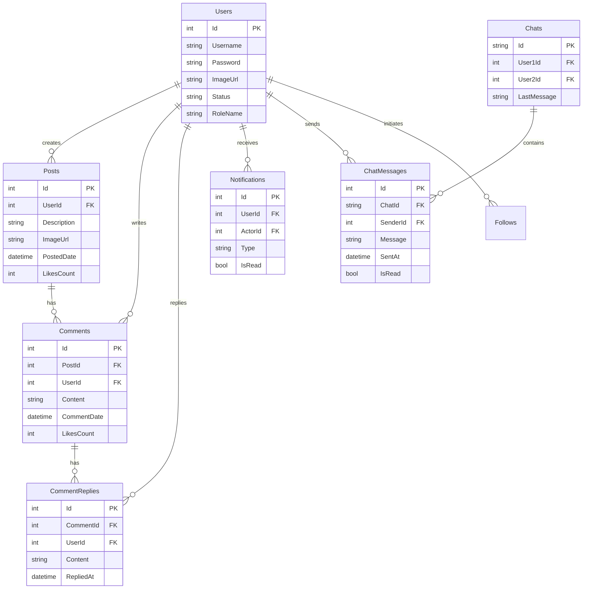

  

# [BookMe] - Red Social

Plataforma de red social desarrollada para explorar y dominar la implementación de consultas SQL crudas de alto rendimiento y la comunicación bidireccional en tiempo real mediante WebSockets.

## Arquitectura de Datos

## Descripción general

Este proyecto nace con el objetivo técnico de profundizar en el manejo avanzado de bases de datos y sistemas en tiempo real dentro del ecosistema .NET. A diferencia de implementaciones tradicionales con ORMs como EF Core, este sistema utiliza Dapper para ejecutar consultas SQL crudas (Raw SQL), permitiendo un control total sobre la optimización y el rendimiento de las queries.

Adicionalmente, integra SignalR para gestionar eventos en tiempo real, permitiendo características como chat instantáneo y notificaciones en vivo, replicando la experiencia de usuario fluida de las redes sociales modernas.

### Aspectos técnicos destacados
- **Optimización de Consultas (Raw SQL):** Uso extensivo de Dapper para mapeo de objetos y ejecución de queries complejas, priorizando el rendimiento.
- **Comunicación en Tiempo Real:** Implementación de WebSockets vía SignalR para mensajería instantánea y actualizaciones de estado sin recargar la página.
- **Seguridad de Contenido con IA:** Integración con Azure AI Safety Content para moderar automáticamente el contenido de los posts, asegurando un entorno seguro.
- **Paginación Eficiente:** Estrategias de carga diferida y paginación en comentarios, respuestas y chats para optimizar el ancho de banda y la velocidad de carga.

## Funcionalidades principales

### Gestión de contenido (Feed)
El núcleo de la interacción social permite a los usuarios compartir y consumir contenido de manera dinámica.
- **Publicaciones inteligentes:** Creación de posts validados en tiempo real por Azure AI para filtrar contenido inapropiado.
- **Interacciones anidadas:** Sistema robusto de comentarios y respuestas a comentarios. Ambas secciones cuentan con paginación independiente para evitar la sobrecarga de datos en posts que cuentan con demasiada información.

### Perfil
Herramientas completas para gestionar la identidad digital y las conexiones.
- **Personalización de perfil:** Cambiar la foto de perfil.
- **Gestión de seguidores:** Envío y aceptación de solicitudes de seguimiento.
- **Privacidad y bloqueo:** Funcionalidad para bloquear usuarios no deseados, impidiendo interacciones futuras.

### Comunicación y notificaciones
- **Chat en tiempo Real:** Sistema de mensajería privada con seguidores. El historial de chat está paginado para garantizar una carga rápida incluso en conversaciones largas.
- **Centro de notificaciones:** Alertas instantáneas sobre interacciones (likes, comentarios, solicitudes) recibidas a través de SignalR.

## Despliegue (Azure)

La aplicación tanto frontend como backend ha sido desplegada utilizando App Services de Microsoft Azure.
Para la base de datos pude notar que Azure suele "dormir" las instancias cuando no hay actividad, por lo que opté por usar una instancia de MonsterASP.NET.

