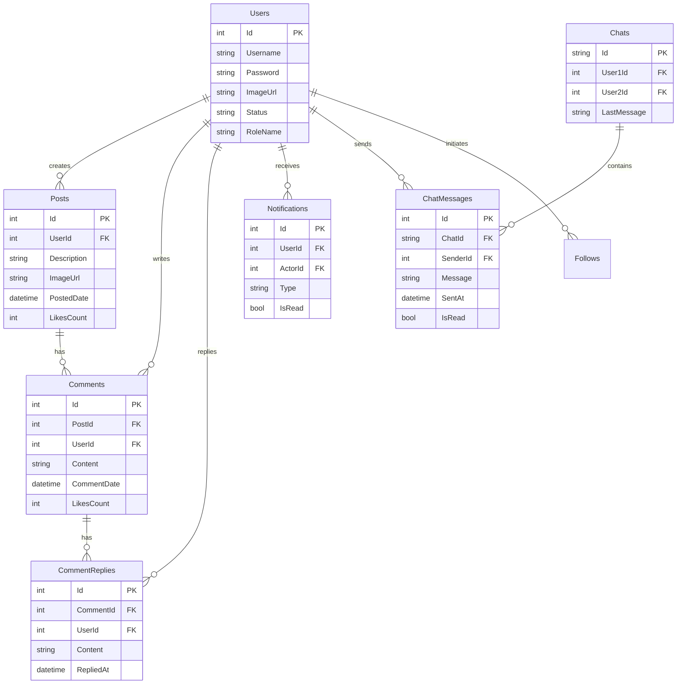

  

# [BookMe] - Social Network

A social networking platform developed to master high-performance raw SQL query implementation and bidirectional real-time communication using WebSockets.

## Data arquitecture

## Overview

This project was built with the technical goal of deepening expertise in advanced database management and real-time systems within the .NET ecosystem. Unlike traditional implementations using full ORMs like EF Core, this system leverages Dapper to execute raw SQL queries, providing granular control over query optimization and performance.

Additionally, it integrates SignalR to handle real-time events, enabling features such as instant chat and live notifications, replicating the fluid user experience of modern social networks.

### Key technical aspects
- **Query Optimization (Raw SQL):** Extensive use of Dapper for object mapping and complex query execution, prioritizing performance.
- **Real-Time Communication:** Implementation of WebSockets via SignalR for instant messaging and status updates without page reloads.
- **AI Content Safety:** Integration with Azure AI Safety Content to automatically moderate post content, ensuring a safe environment.
- **Efficient Pagination:** Lazy loading and pagination strategies applied to comments, replies, and chat history to optimize bandwidth and load speeds.

## Main features

### Content management (Feed)
The core of social interaction allows users to share and consume content dynamically.
- **Smart Posts:** Creation of posts validated in real-time by Azure AI to filter inappropriate content.
- **Nested Interactions:** Robust system for comments and replies. Both sections feature independent pagination to avoid data overload in threads with extensive activity.

### Profile
Complete tools for managing digital identity and connections.
- **Profile Customization:** Ability to change profile pictures.
- **Follower Management:** Sending and accepting follow requests.
- **Privacy & Blocking:** Functionality to block unwanted users, preventing future interactions.

### Communication & notifications
- **Real-Time Chat:** Private messaging system with followers. Chat history is paginated to ensure fast loading even in long conversations.
- **Notification Center:** Instant alerts for interactions (likes, comments, requests) received via SignalR.

## Deployment (Azure)

Both the frontend and backend applications have been deployed using Microsoft Azure App Services.
Regarding the database, since Azure tends to "sleep" instances during inactivity, I opted to use a MonsterASP.NET instance for better persistence availability.

 
 

Made by [Alejandro.NET](https://alejandropg845.github.io/resume)
